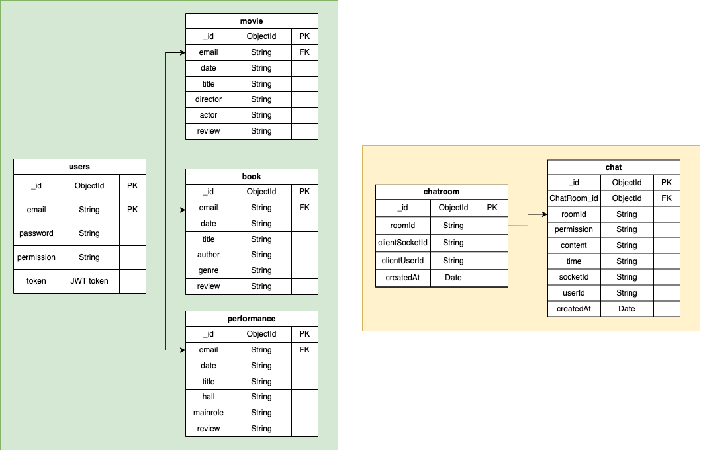

<h1> CultureLog </h1>

<h1> 프로젝트 소개 </h1>
<h3> 1. 기획 의도 </h3>
모든 것이 바쁘게 흘러가는 요즘, 
문화생활까지 자연스레 지나쳐버리게 되는 날이 많아졌습니다. 
CultureLog는 내가 보고 듣고 읽은 것들을 기록하는 공간입니다. 
자신이 경험한 책/공연/영화와 리뷰를 쉽고, 간편하게 기록할 수 있는 웹사이트를 만들었습니다. 
자신이 경험한 문화생활과 리뷰, 그리고 생각을 기록하며 삶의 빈 곳을 채워보는 건 어떨까요?
<h3> 2. 주요 기능 </h3>

|기능| 설명|
|:---|:---|
|Main Page|1. 달력, 그날의 기록, 올해 나의 기록 등 노출. 2. Header를 통해 로그아웃 가능.|
|Calendar|1. 이벤트를 등록 가능. 2.날짜를 클릭하면 로그를 기록할 수 있는 페이지로 넘어가고 해당 날짜를 가져 옴. 3. 날짜를 클릭하면 해당 날짜에 기록된 데이터가 영화, 책, 공연이 서로 다른 색으로 표시. 4. 날짜를 클릭하면 해당 날짜에 기록된 데이터 내용이 달력 아래에 노출. 5. 상세보기를 누르면 등록한 이벤트의 상세 내용이 나오고, 삭제 가능.|
|Signup / Login / Logout|1. 아이디 중복 확인을 할 수 있다. 2. 회원가입 시 유효성 검사 가능. 3. 회원가입 시 일반 사용자: permission을 default로 생성, 관리자: DB에서 permission을 직접 설정. 4. 로그인에 성공할 경우 토큰이 생성. 5. 로그아웃에 성공할 경우 토큰을 비워주어야 함.|
|Board (Movie / Book / Performance)|1. 검색 창에 검색어를 입력하면 서버를 통해 각 API에 요청한 데이터를 받아 옴.(검색 기능 내 유효성 검사) 2. 검색 창 밑에 API에서 받아온 해당 검색 데이터 리스트가 나타나고 클릭 시 포스터, 제목, 감독, 장르 등의 세부 옵션 폼 내용 자동 완성 3. 리뷰 내용을 입력 후 폼을 전송하면 해당 폼의 정보가 DB에 저장 됨. (로그인 유저 정보 포함되어 있음, 폼 전송 시 유효성 검사)|
|Graph|1. 모든 사용자의 책, 영화, 공연 기록 데이터를 가져온다. 2. 로그인 한 사용자의 책, 영화, 공연 기록 데이터를 가져 옴. 3. 데이터를 바탕으로 그래프가 그려짐.|
|Api|[ 공통 ] 1. API에서 받아온 데이터를 폼 양식과 DB에 필요한 object 타입으로 가공.  [ 개별 ] 1. Movie API (Naver Open API) 2. Book API (Aladin API) 3. Performance API (KOPIS 공연예술통합전산망 API)|
|mongoDB|1. users    a. 회원가입 시 아이디, 비밀번호, permission, token의 항목을 가진 스키마 생성   b. 회원가입 시 비밀번호는 암호화하여 저장.(Bcrypt 이용)   c. 로그인 시 입력된 비밀번호와 데이터베이스에 있는 암호화된 비밀번호가 같은지 비교   d. 로그인 시 jsonwebtoken을 이용해 토큰 생성(JWT 이용)   e. 로그아웃 시 토큰은 빈값으로 만들어 주어 쿠키는 자동으로 없어지도록 구현 2. chatting   a. chatroom: 각 유저의 채팅방에 대한 정보 및 userSocketID, userID가 기록된다.  *  로그인을 하지 않은 사용자의 경우 임의 값이 설정된다.  *  24시간 이후 자동 삭제가 되지만, 사용자가 연결을 종료해도 삭제된다.  *  관리자가 수동으로 방을 나가는 경우에도 삭제가 된다.   b. chats: 사용자들의 메시지 기록이 저장되는 곳이며, 이 때 저장되는 정보는 사용자 정보, 메시지 정보, 방 정보가 저장된다.  *  24시간 이후 자동 삭제가 되지만, 사용자가 연결을 종료해도 삭제된다. 3. Board   a.  book, movie, performance의 스키마 형성   b.  데이터 객체 안에는 유저 email, 날짜, 폼 정보 등이 들어있다.|
|Chatting|[ 공통 ] 1. 챗봇 아이콘을 누르면 채팅창이 열린다.  2. 새로운 메시지가 올 경우 챗봇 아이콘에 빨간색 알림이 나온다.  [ 관리자 전용 ] 1. 채팅방 리스트가 있다. 2. 채팅방 리스트 데이터 : 새로고침 시 DB에서 받아오기 or 사용자가 메시지를 입력하면 자동 생성 (단, 관리자가 접속해 있는 경우에만) 3. 채팅방 나가기 기능이 있다. 4. 새로운 메시지가 올 경우 각 방 별로 데이터가 갱신된다. 5. 각 방에 대한 마지막 메시지와 메시지 전송한 사람의 ID 또는 닉네임을 볼 수 있다. 6. 각 방에 새로운 메시지가 오면 시간에 따라 최상단으로 이동한다. 7. 각 방에 새로운 메시지가 오면 읽지 않은 메시지 숫자와 알림이 표시된다.|

<h3> 3. 배포 사이트 </h3>

<h1> 프로젝트 팀원 </h1>

|박효현(FE, BE)|김혜연(BE)|이채연(FE, BE)|이채영(FE)| 
|:---:|:---:|:---:|:---:|
||||| 
| |||| 

<h1> 기술 스택 </h1>
<h2>  Front-end </h2>

<h2>  Back-end </h2>

  

  

<h2>ErDiagram</h2>

